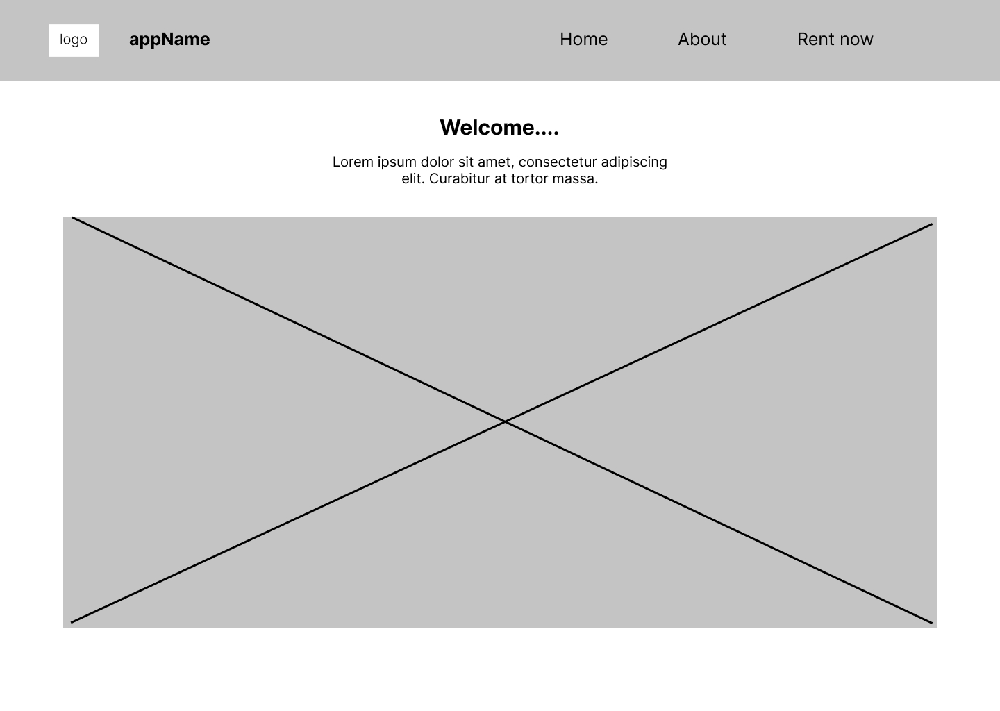
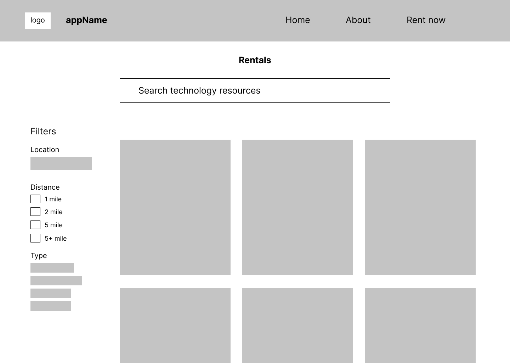
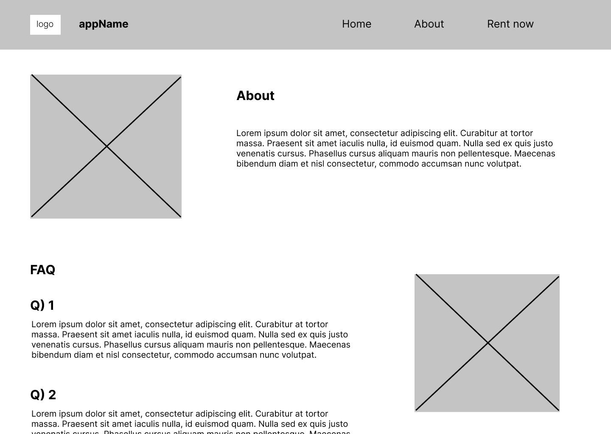

 # Design Specification

 ## Problem 

The switch to online learning during the pandemic has created a greater educational divide between low-income students and their peers. Students from low-income families have lower grades and higher absenteeism rates when attending classes online, due to a lack of access to technology and a suitable learning environment. As schools transition back to in-person learning, they are continuing to utilize the same technologies they had used during the pandemic to teach and engage students. This will cause low-income students to remain excluded and discouraged from pursuing their education. How might we aid low-income students in acquiring the necessary digital resources for a high-quality education so that they do not fall further behind?

According to New America, internet access at home is required for students to receive a quality education. However, approximately 16.9 million children do not have access to high-speed internet at home (Farry, 2021). A vast majority of the children in this statistic are low-income people of color, with African American and Hispanic households being 1.3 to 1.4 times as likely as white households to lack digital accessibility (McDonald, 2020). This problem persists in early education in marginalized communities and it is critical to aid these students before they fall through the cracks of education. The UN states that as classrooms shift to relying on technology for learning and homework, low-income students are less equipped to participate and are at a high risk of dropping out of school (Guterres,  2021). In this pursuit, it is essential for us to involve support for and from the educators. 

Washington State, specifically, has seen increased inequities in quality education through the pandemic. In 2019, the Washington Education Association began the process of creating educational justice work called “A Roadmap to Reducing Barriers to Educational Justice in Washington State” that states various barriers to the educational justice that our state’s system of education presents for underrepresented and marginalized students (Skipton, 2021). This was only exemplified when COVID-19 hit. Causes such as lack of funds, conditions, and large student-to-teacher ratios have all contributed to inadequate education for low-income students. With many existing solutions not being able to fulfill the needs that students need for quality education, a better solution must be made that allows students from all income levels and all necessities to come together and get the proper education that they need.

 ### Citations
Farry, Maggie. “An Old Problem in the New Normal: The Digital Divide.” New America, 6 July 2021, 	https://www.newamerica.org/the-thread/an-old-problem-in-the-new-normal-the-digital-divide/

Guterres, António. “— SDG Indicators.” — SDG Indicators https://unstats.un.org/sdgs/report/2021/

McDonald, John. “Despite improved access, digital divide persists for minority, low-income students.”  UCLA Newsroom, 8 December 2020, https://newsroom.ucla.edu/releases/digital-divide-persists-for-minority-low-income-students

Skipton, Alice. “Seeking a Path to Educational Justice in Washington State | UW College of Education.” UW College of Education, 29 November 2021, https://education.uw.edu/news/seeking-path-educational-justice-washington-state

 

 ## Solution
 
 This web app provides an interactive state map for a quick intuitive path of resources, a rental system for educators to access technology for student educational purposes, and filter systems within the rental platform. These features are to aid low-income students in acquiring the necessary digital resources for a high-quality education through the support of their Washington State  K-12 educators.

### Site Layout

### 1) Washington State Map (Home Page):

Our landing page will feature a navigation bar at the top to get to different pages, a headline, and an interactive map of the state of Washington. The navbar pages will have the app’s name, the logo, and the pages that can be accessed are the home, about, and rental pages. The map will contain the name of counties as hyperlinks. Users will not be able to zoom in or out on the map as it will be static. The user will be able to hover over their respective county within the state, allowing them to click on the county and be redirected to that county's resources. From this list of resources, the user can choose to rent the items or not, and filter down the resources some more if they so wish. This provides a quick, intuitive path for educators to quickly access the information they need for their respective location. 

### 2) Rental Systems:

- Equipment list
- Reserve equipment

Another one of our features will be the student technology rental system. This rental system will run through the school so only students will be able to check out technology products. This feature will incorporate an equipment list that allows them to reserve equipment based on their need. We will also include an overview section that explains the process to the students so that they know what is expected of them during their time using the equipment. The page will include a nav bar at the top, a header, search bar underneath the header, filter options on the left screen, and various photos of available equipment. 

Users will be able to reserve equipment by searching for specific technology at the top search bar, browse by scrolling through the pictures, or simply press the image to find more information. No interaction will be made when users hover over the images. 

Once a user has selected the image for their requested equipment, further descriptions and images can be found. This screen will be where the user reserves the equipment by entering their name, email, and phone number. Once information is filled the user will press the rent button to get a confirmation of their equipment. 

Applying this feature as a part of our website will allow families with low-income to have a solution for accessing technology for educational purposes. We intend on giving students a way to access technology that they may have been stripped from due to COVID-19 and we are hoping that the rental system will allow students to gain this access again.

### 3) Filter Systems:

_(Allowing user to search type of resource they need (ex: wifi) and shows availability)_ 

We will also have a filter system feature that would allow users to search for a type of resource that they need, like WiFi, and show whether or not that resource is available. By using the filters, the user will be given the list of items that they asked for, and they will be provided with information on how long they can have the resource for. The filters will be inclusive because we want to provide the user with any resource that fits the criteria they searched for. The list of filterable resources include the type of technology, such as laptops, WiFi, tablets, cameras, and microphones. It will also include location that the user can input, which will filter down the available resources to only have those that are available in or near that specific area. And lastly, distance will be a filter as well, in which users can choose to filter down the available resources within a certain distance, such as 1 mile, 2 miles, 5 miles, or 5+ miles. This will allow users to pick how far they want to go to get this resource. There might be a chance that there will be no list items that match all the selected filters, so the system will tell the user this and provide the available items that are in a wider range. For example, if the user asks for a laptop within 1 mile of their location but they are not available, the system will alert the user of this and provide a list of laptops that are within 2, 5, or 5+ miles of the user’s location instead, depending on which distance is closest and has the resources available. 

### 4) About Page:

The about page will be a simple display where users will only have the interactivity to scroll up and down the page. There will be a nav bar, about portion, and FAQ section. The _About_ description will include the purpose and goal of our website. With a photo of a logo. Below this will be the _FAQ_ portion that will include around 10 commonly asked questions that users could go to recieve help.

