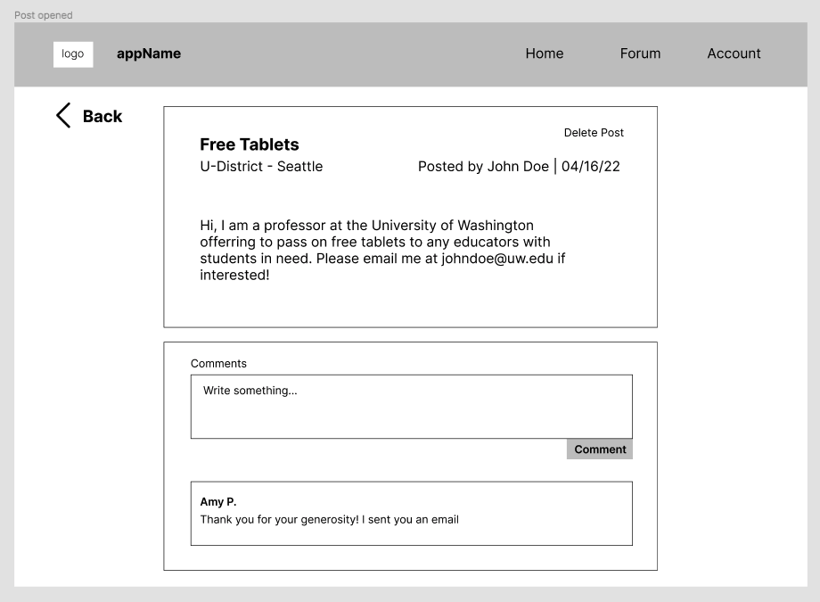
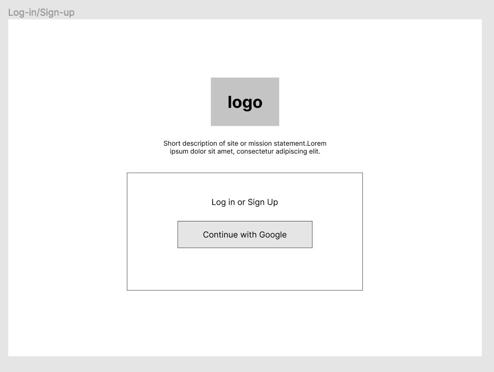

 # Design Specification

 ## Problem 

The switch to online learning during the pandemic has created a greater educational divide between low-income students and their peers. Students from low-income families have lower grades and higher absenteeism rates when attending classes online, due to a lack of access to technology and a suitable learning environment. As schools transition back to in-person learning, they are continuing to utilize the same technologies they had used during the pandemic to teach and engage students. This will cause low-income students to remain excluded and discouraged from pursuing their education. How might we aid low-income students in acquiring the necessary digital resources for a high-quality education so that they do not fall further behind?

According to New America, internet access at home is required for students to receive a quality education. However, approximately 16.9 million children do not have access to high-speed internet at home (Farry, 2021). A vast majority of the children in this statistic are low-income people of color, with African American and Hispanic households being 1.3 to 1.4 times as likely as white households to lack digital accessibility (McDonald, 2020). This problem persists in early education in marginalized communities and it is critical to aid these students before they fall through the cracks of education. The UN states that as classrooms shift to relying on technology for learning and homework, low-income students are less equipped to participate and are at a high risk of dropping out of school (Guterres,  2021). In this pursuit, it is essential for us to involve support for and from the educators. 

Washington State, specifically, has seen increased inequities in quality education through the pandemic. In 2019, the Washington Education Association began the process of creating educational justice work called “A Roadmap to Reducing Barriers to Educational Justice in Washington State” that states various barriers to the educational justice that our state’s system of education presents for underrepresented and marginalized students (Skipton, 2021). This was only exemplified when COVID-19 hit. Causes such as lack of funds, conditions, and large student-to-teacher ratios have all contributed to inadequate education for low-income students. With many existing solutions not being able to fulfill the needs that students need for quality education, a better solution must be made that allows students from all income levels and all necessities to come together and get the proper education that they need.

### Citations
Farry, Maggie. “An Old Problem in the New Normal: The Digital Divide.” New America, 6 July 2021, 	https://www.newamerica.org/the-thread/an-old-problem-in-the-new-normal-the-digital-divide/

Guterres, António. “— SDG Indicators.” — SDG Indicators https://unstats.un.org/sdgs/report/2021/

McDonald, John. “Despite improved access, digital divide persists for minority, low-income students.”  UCLA Newsroom, 8 December 2020, https://newsroom.ucla.edu/releases/digital-divide-persists-for-minority-low-income-students

Skipton, Alice. “Seeking a Path to Educational Justice in Washington State | UW College of Education.” UW College of Education, 29 November 2021, https://education.uw.edu/news/seeking-path-educational-justice-washington-state

 

## Solution
 
This web app’s main feature is  a community based forum for educators to help each other find technology equipment and other technology resources, such as available scholarships or workshops, for student educational purposes. The overall goal of this platform is to aid low-income students in acquiring the necessary digital resources for a high-quality education through the support of their Washington State  K-12 educators.

## Features and Site Layout

### 1) Home/Forum Page:

Our landing page will feature a navigation bar at the top to get to different pages, a headline, and a short, one-sentence description about our app. The landing page will also be accessible as the forum page only when users are logged in. The navbar will have the app’s name, the logo, and the pages that can be accessed are the Home, Forum, and Your Posts (inside the "Account" button as a drop-down). This page will be a simple display where users will only have the interactivity to scroll up and down the page. 

When users are logged in the following forum page will be present. The forum page will be a resource forum for users to get in contact with other educators that have certain resources they can give, and users can also post to request resources as well. At the top of the forum page, users will be able to create a post. Underneath the create post box, users can search for keywords to find specifically what they are looking for. The keywords search will be a text input that will search the database for the inputted keyword and display only posts that have the keyword in them. Underneath the search bar will be the posts of the feed. A post will be a box with the user’s profile picture on the top left. The user’s name, location, and post content will be displayed on the right of the profile picture. The user’s name and post title will be in bold. 

Users will also be able to make a post while on the forum page to look for a resource or to inform others that they have a resource. To create a post, users will have to write a title for the post and the post description. This will be a form that users can fill out with both text inputs being a required field. There will be no word limit for the post. Once users have filled out the form, users can click on the “post” button. To validate the form, the app will check that both text inputs have text in them. If users are missing a required field, the app will display a message under the form that tells them if a field is missing. If the form validates successfully and there are no errors, the user’s new post will appear at the top of the feed. If it encounters an error, the error will be displayed in red text under the form to inform the user. 

Additionally, users will be able to type keywords for certain technologies or resources they are looking for in the search bar. Search results (relevant posts) will display under the search bar after the user presses the enter key. The search bar does not search dynamically as the user is typing.

Lastly, users will be able to scroll up and down in the list of all posts in the forum (when on the forum page). Clicking on any area of the post preview within the sectioned lines will send the user to a new page with more details about the post.

### 2) Interacting with Forum Posts

After clicking on a post preview on a different page, the user will be able to see a page with the full details of that specific post. This page will display all elements of the post (title, body, author, location, and date) and a comment section. The comment section will have a text field area for the user to type and submit a comment on the post. If the user presses the button to submit a comment and does not type anything into the text field, nothing will be submitted. Under the text field area, the user can scroll through comments made by other users.

### 3) User Accounts

In order for users to access and interact in the forum page, an account must be created through our website. If entering the forum page users will be prompted to log-in before viewing. If on the home page, the nav bar will consist of the option to Log-in. The option to log in will also be available on the nav bar in all screens. 
Users will be prompted to a landing page that prompts the user with two options in buttons:

#### 4) Log In and Sign Up:

In order for users to access and interact in the forum page, the user must be signed in to an account. All user accounts are based on their Google account; on the login page, there will be a button to allow the user to log in or sign up with their google account. Upon clicking on the button to continue with google, the user may be sent to an external site to enter their Google account information, but they will be sent to the app’s home page if their login was successful. If entering the forum page from another page without being signed in,  users will be prompted to log-in before viewing. If on the home page, the nav bar will consist of the option to Log-in. The option to log in will also be available on the nav bar in all screens. 

A log out option button will be at the top header nav bar (accessible when hovering over "Account"). 

#### 5) Seeing posts made by the user:

Additionally, users will able to view all posts they have made by clicking the "Your Posts" button in the drop-down menu of the navigation bar. 

